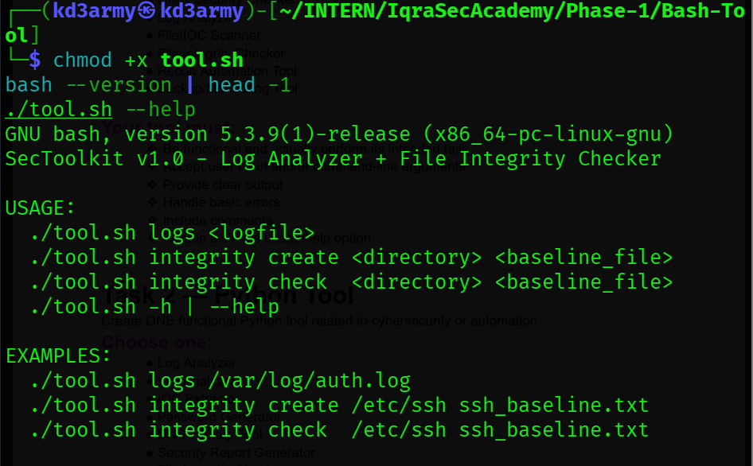
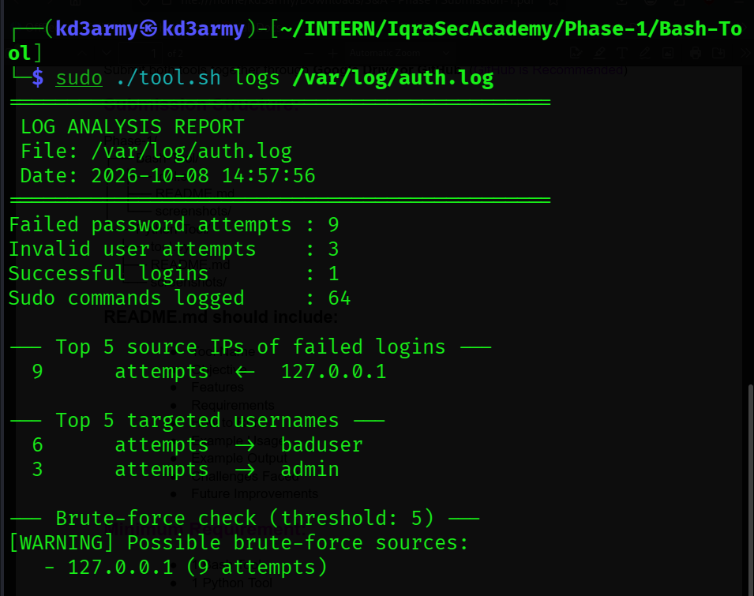
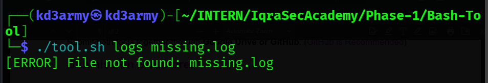
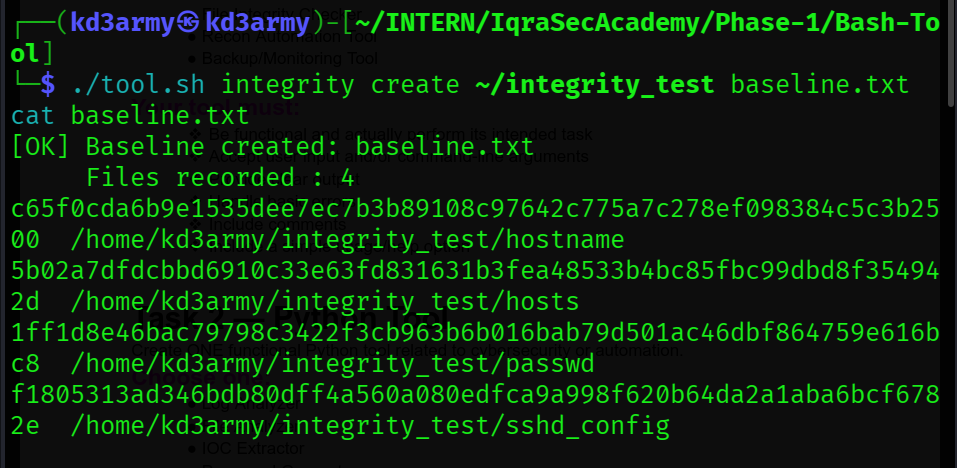
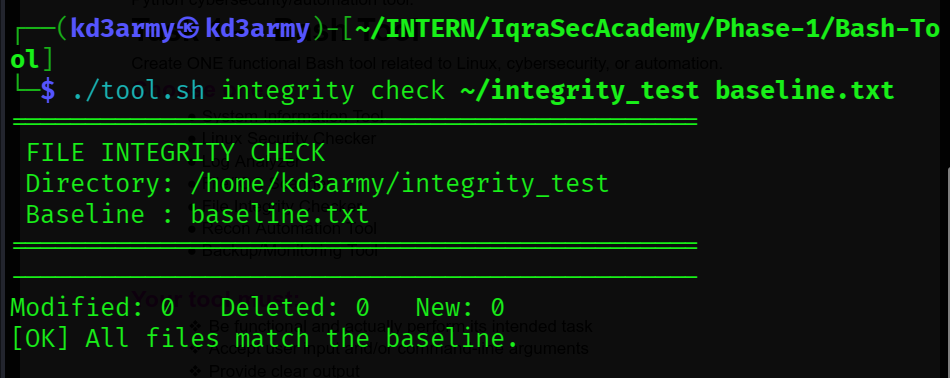
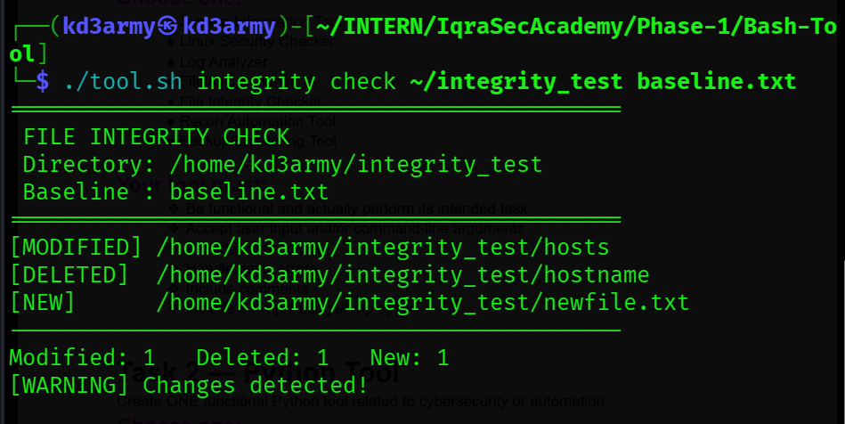
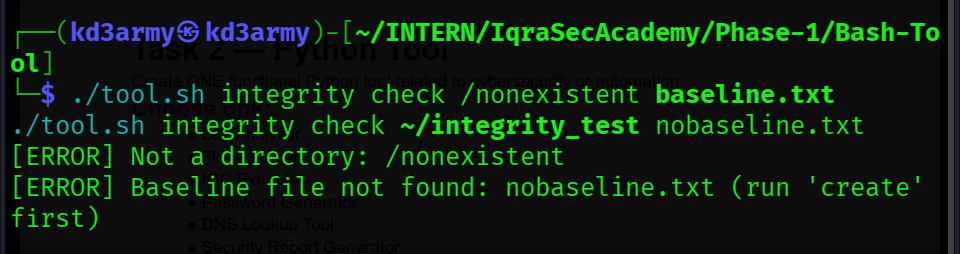

# ## Tool Name
SecToolkit (Bash): Log Analyzer + File Integrity Checker

## Objective
A single Bash tool with two modes that automate common Linux security tasks:
analyzing SSH authentication logs for suspicious activity, and detecting
unauthorized file changes using SHA-256 hashes.

## Features
- **Log Analyzer (`logs`)**
  - Counts failed passwords, invalid users, successful logins and sudo commands
  - Lists the top 5 source IPs and top 5 targeted usernames
  - Warns about possible brute-force sources (5+ failed attempts from one IP)
- **File Integrity Checker (`integrity`)**
  - `create`: records a SHA-256 baseline for every file in a directory
  - `check`: reports `[MODIFIED]`, `[DELETED]` and `[NEW]` files
  - Handles filenames with spaces
- Built-in help (`-h` / `--help`) and clear error messages

## Requirements
- Linux (tested on Kali Linux)
- Bash 4+ (tested on 5.3.9), for associative arrays
- Standard tools: `grep`, `awk`, `sed`, `sort`, `find`, `xargs`, `sha256sum`, `realpath`
- `sudo` to read `/var/log/auth.log`

## How to Run
```bash
chmod +x tool.sh
./tool.sh --help
```

## Example Usage
```bash
sudo ./tool.sh logs /var/log/auth.log
./tool.sh integrity create ~/integrity_test baseline.txt
./tool.sh integrity check  ~/integrity_test baseline.txt
```

## Example Output

### Log analysis (real data from my own machine)
```
==============================================
 LOG ANALYSIS REPORT
 File: /var/log/auth.log
 Date: 2026-10-08 14:57:56
==============================================
Failed password attempts : 9
Invalid user attempts    : 3
Successful logins        : 1
Sudo commands logged     : 64

--- Top 5 source IPs of failed logins ---
  9      attempts  <-  127.0.0.1

--- Top 5 targeted usernames ---
  6      attempts  ->  baduser
  3      attempts  ->  admin

--- Brute-force check (threshold: 5) ---
[WARNING] Possible brute-force sources:
   - 127.0.0.1 (9 attempts)
```
The failed logins were generated by attempting SSH logins with wrong
passwords against my own machine.

### File integrity check after tampering
```
==============================================
 FILE INTEGRITY CHECK
 Directory: /home/kd3army/integrity_test
 Baseline : baseline.txt
==============================================
[MODIFIED] /home/kd3army/integrity_test/hosts
[DELETED]  /home/kd3army/integrity_test/hostname
[NEW]      /home/kd3army/integrity_test/newfile.txt
----------------------------------------------
Modified: 1   Deleted: 1   New: 1
[WARNING] Changes detected!
```

### Error handling
```
[ERROR] File not found: missing.log
[ERROR] Not a directory: /nonexistent
[ERROR] Baseline file not found: nobaseline.txt (run 'create' first)
```

## Screenshots

### Help output


### Log analyzer on real /var/log/auth.log data


### Log analyzer error handling (missing file)


### Integrity checker: baseline creation


### Integrity checker: no changes


### Integrity checker: modified, deleted and new files detected


### Integrity checker: error handling


## Challenges Faced
- **Log permissions:** `/var/log/auth.log` is readable only by root and the
  `adm` group, so the tool must be run with `sudo`.
- **Overcounted sudo usage:** each sudo command writes several log lines
  (including `pam_unix(sudo:session)` entries). Counting `sudo:` inflated the
  total, so I changed it to count only `COMMAND=` lines.
- **False positives from my own commands:** the first version reported 10
  failed logins and 2 successful logins, but the IP table only showed 9
  failures. The extra lines were sudo log entries recording my own
  `grep 'Failed password'` and `grep 'Accepted'` commands. Fixed by matching
  only lines written by `sshd` (`sshd[^:]*: Failed password`).
- **No failed logins on a fresh system:** I generated real failed attempts by
  trying wrong passwords against my own SSH service.
- **Filenames with spaces:** solved with `find -print0` and `xargs -0`.
- **Baseline listing itself:** the baseline file changes each time it is
  written, so the tool excludes it from its own scan.

## Future Improvements
- Parse log fields by position instead of searching plain text, so commands
  recorded in the log can't be mistaken for events
- Support IPv6 addresses and other log formats (journald, Apache, nginx)
- Make the brute-force threshold a command-line option
- Save reports to a file and add colored output
- Run integrity checks on a schedule with cron and send alerts
- Track file permissions and ownership, not just content hashes
