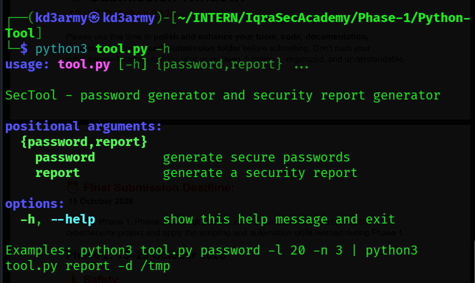
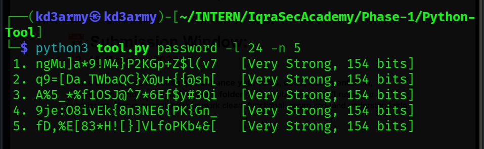
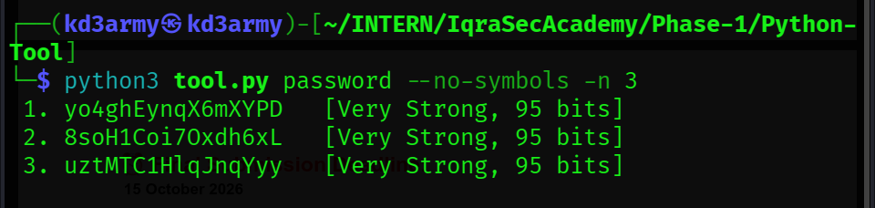
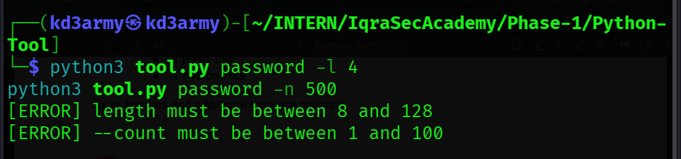
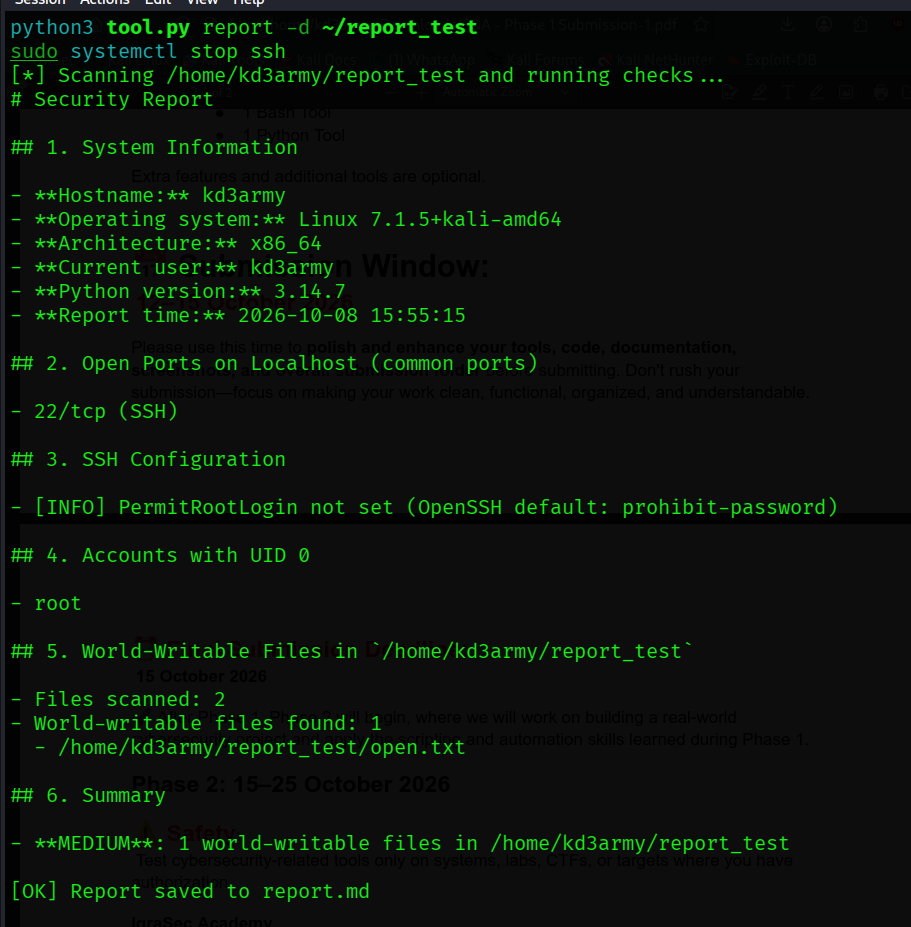
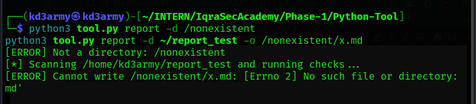
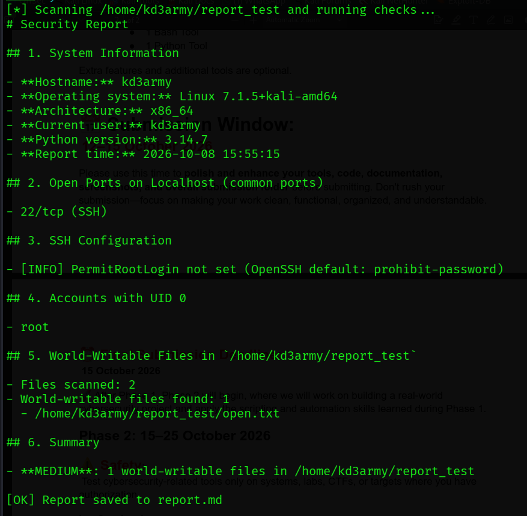

## Tool Name
SecTool (Python): Password Generator + Security Report Generator

## Objective
A single Python tool with two modes: a secure password generator and a
security report generator that checks basic hardening issues on a Linux
machine and saves the results as a Markdown report.

## Features
- **Password Generator (`password`)**
  - Uses the `secrets` module (cryptographically secure, unlike `random`)
  - Guarantees lowercase, uppercase, digits and symbols in every password
  - Configurable length (8-128), count (1-100) and `--no-symbols` option
  - Shows a strength label and entropy estimate for each password
- **Security Report Generator (`report`)**
  - System information (hostname, OS, user, timestamp)
  - Scans common ports on localhost and flags risky services
  - Checks the SSH `PermitRootLogin` setting
  - Lists accounts with UID 0
  - Finds world-writable files in a chosen directory
  - Saves a Markdown report with a severity summary
- Built-in help (`-h`) and clear error messages

## Requirements
- Python 3.8+ (tested on 3.14.7)
- Standard library only, no packages to install
- Linux for `report` mode (reads `/etc/passwd` and `/etc/ssh/sshd_config`);
  `password` mode works anywhere

## How to Run
```bash
chmod +x tool.py
python3 tool.py -h
```

## Example Usage
```bash
python3 tool.py password -l 20 -n 3
python3 tool.py password --no-symbols -n 3
python3 tool.py report -d ~/report_test
python3 tool.py report -d ~/report_test -o myreport.md
```

## Example Output

### Password generator
```
 1. 1jBLCE,4(OT@sUiCP)4b   [Very Strong, 128 bits]
 2. :v%J9AfrMfd4a]6{]nX&   [Very Strong, 128 bits]
 3. }Avi1Hk4gbiDa,zSd:Iw   [Very Strong, 128 bits]
```
These are examples only and should never be used for real accounts.

### Security report (saved as report.md)
```
# Security Report

## 1. System Information

- **Hostname:** kd3army
- **Operating system:** Linux 7.1.5+kali-amd64
- **Architecture:** x86_64
- **Current user:** kd3army
- **Python version:** 3.14.7
- **Report time:** 2026-10-08 15:55:15

## 2. Open Ports on Localhost (common ports)

- 22/tcp (SSH)

## 3. SSH Configuration

- [INFO] PermitRootLogin not set (OpenSSH default: prohibit-password)

## 4. Accounts with UID 0

- root

## 5. World-Writable Files in `/home/kd3army/report_test`

- Files scanned: 2
- World-writable files found: 1
  - /home/kd3army/report_test/open.txt

## 6. Summary

- **MEDIUM**: 1 world-writable files in /home/kd3army/report_test
```
The SSH service was started before the scan so port 22 would show as open,
and the world-writable file was created on purpose with `chmod 666` to test
detection.

### Error handling
```
[ERROR] length must be between 8 and 128
[ERROR] --count must be between 1 and 100
[ERROR] Not a directory: /nonexistent
[ERROR] Cannot write /nonexistent/x.md: [Errno 2] No such file or directory: '/nonexistent/x.md'
```

## Screenshots

### Help output


### Password generator


### Password generator options


### Password generator error handling


### Security report


### Report error handling


### Saved report file


## Challenges Faced
- **Choosing a secure random source:** `random` is predictable, so I used
  `secrets` and `secrets.SystemRandom().shuffle` instead.
- **Guaranteeing character variety:** purely random passwords sometimes miss
  a character type, so I pick one character from each set first, fill the
  rest randomly, then shuffle.
- **Reading the SSH config safely:** the file may be missing or unreadable,
  so the tool catches `FileNotFoundError` and `PermissionError`. It also
  stops at the first `Match` block, since those settings only apply to
  specific users.
- **Scanning for world-writable files:** `os.lstat` is used instead of
  `os.stat` so symlinks are not followed, and unreadable folders are skipped
  without crashing.
- **Port scan results depend on what is running:** my first report showed no
  open ports because the SSH service was stopped. After starting it, port 22
  was detected, so results change with system state.

## Future Improvements
- Handle `Include` lines in `sshd_config` (for example `sshd_config.d/`)
- Scan more ports and detect services by banner, not just by port number
- Add checks for password policy, pending updates and firewall status
- Export the report as HTML or JSON
- Fix the grammar in the summary when exactly one file is found
- Add a passphrase mode to the password generator
